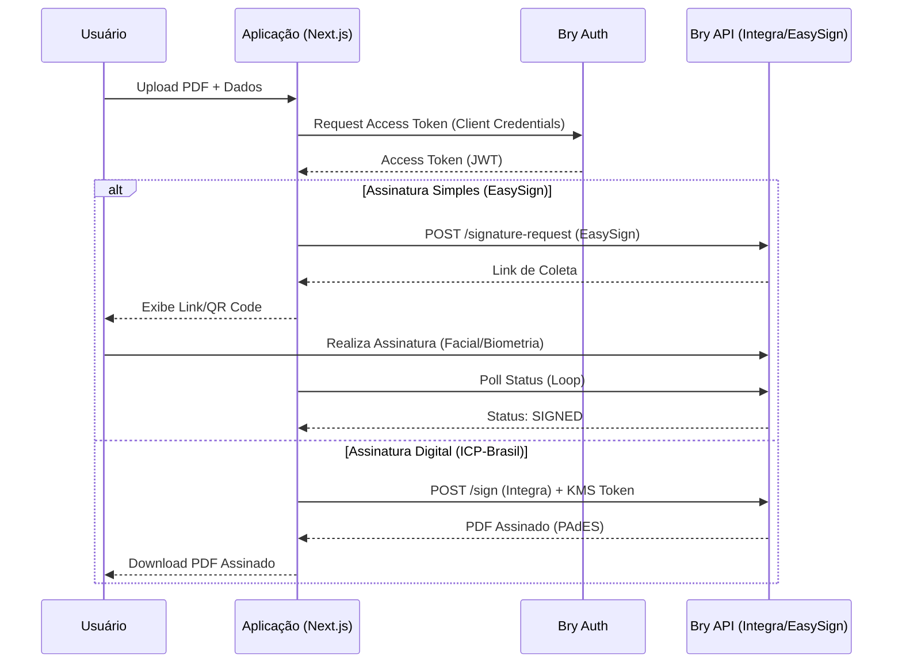

# BRY-SIGNER

Aplicação para assinatura digital e eletrônica de documentos PDF integrando os serviços da Bry Tecnologia (Assinatura Simples e Digital ICP-Brasil).

## 🚀 Tecnologias


## ✨ Funcionalidades

O projeto suporta dois fluxos distintos de assinatura via API da Bry Tecnologia:

### 1. Assinatura Simples (EasySign)
Focada em **praticidade e biometria**. Ideal para documentos que não exigem certificado ICP-Brasil, mas requerem validação de identidade (ex: reconhecimento facial).
- **Fluxo**: O usuário preenche dados (Nome, Email, CPF), faz upload do PDF e recebe um link para assinatura.
- **Validação**: Pode incluir biometria facial e geolocalização.
- **Endpoint**: Utiliza a API EasySign (`/fw/v1`).

### 2. Assinatura Digital (ICP-Brasil)
Focada em **validade jurídica máxima**. Utiliza certificados digitais em nuvem (Bry KMS / PSC).
- **Fluxo**: O backend utiliza credenciais KMS configuradas para assinar o PDF digitalmente.
- **Recursos**: Suporta carimbo do tempo, configuração visual da assinatura (imagem, texto, QR Code) e validação de longo prazo (PAdES).
- **Endpoint**: Utiliza a API Integra (`/integra/v1`).

## ⚙️ Configuração

### Pré-requisitos
- Node.js 20+
- Credenciais de acesso à API da Bry (Client ID e Secret).
- (Opcional) Certificado Digital hospedado no Bry KMS.

### Instalação

```bash
# Instalar dependências
npm install

# Rodar em desenvolvimento
npm run dev
```

### Variáveis de Ambiente

Crie um arquivo `.env.local` na raiz do projeto com as seguintes variáveis:

| Variável | Descrição | Obrigatório |
| :--- | :--- | :---: |
| `BRY_CLIENT_ID` | Client ID fornecido pela Bry | Sim |
| `BRY_CLIENT_SECRET` | Client Secret fornecido pela Bry | Sim |
| `BRY_AUTH_URL` | URL de autenticação OAuth | Sim |
| `BRY_INTEGRA_URL` | URL base para Assinatura Digital (Integra) | Sim |
| `BRY_EASYSIGN_URL` | URL base para Assinatura Simples (EasySign) | Sim |
| `BRY_HUB_URL` | URL do Bry Hub | Sim |
| `NEXT_PUBLIC_APP_URL` | URL da aplicação (ex: http://localhost:3000) | Sim |
| `BRYKMS_UUID_CERT` | UUID do certificado no KMS (para assinatura digital) | Não* |
| `BRYKMS_USER` | Usuário do KMS | Não* |
| `BRYKMS_PIN` | PIN do usuário no KMS | Não* |

> *Obrigatório apenas para o fluxo de Assinatura Digital ICP-Brasil.

## 📡 Uso da API

### Assinatura Digital (Endpoint Interno)

**POST** `/api/bry/sign`

Assina um PDF utilizando um certificado em nuvem.

**Body (FormData):**
- `pdfBase64`: String Base64 do arquivo PDF.
- `fileName`: Nome do arquivo.
- `kmsToken`: Token de acesso ao KMS (obtido via `/api/bry/kms-token` ou gerado internamente).
- `kmsType`: Tipo do KMS (`BRYKMS` ou `PSC`).

**Exemplo de chamada:**

```typescript
const formData = new FormData();
formData.append('pdfBase64', 'JVBERi0xLjQK...');
formData.append('fileName', 'documento.pdf');
formData.append('kmsToken', 'eyJhbGciOiJIUz...');
formData.append('kmsType', 'BRYKMS');

const response = await fetch('/api/bry/sign', {
  method: 'POST',
  body: formData
});
```

### Assinatura Simples (EasySign Action)

O fluxo é gerenciado via Server Actions em `src/actions/easySignActions.ts`.

```typescript
import { createSignatureRequest } from '@/actions/easySignActions';

const result = await createSignatureRequest(
  base64Pdf,
  'contrato.pdf',
  'João da Silva',
  'joao@email.com',
  '123.456.789-00', // CPF
  'CPF'
);

if (result.success) {
  console.log('Link para assinatura:', result.signatureLink);
}
```

## 🔄 Fluxo de Dados



## 🛠 Troubleshooting

### Erros Comuns

1.  **Erro `401 Unauthorized` na API da Bry**
    *   **Causa**: `BRY_CLIENT_ID` ou `BRY_CLIENT_SECRET` inválidos, ou token expirado.
    *   **Solução**: Verifique as credenciais no `.env` e se o serviço de autenticação está acessível.

2.  **Certificado não encontrado (`BRYKMS`)**
    *   **Causa**: O `BRYKMS_UUID_CERT` não corresponde a um certificado válido para o usuário `BRYKMS_USER`.
    *   **Solução**: Liste os certificados disponíveis para o usuário no painel da Bry ou via API para obter o UUID correto.

3.  **Erro na Assinatura Simples (EasySign)**
    *   **Causa**: CPF inválido ou formato incorreto.
    *   **Solução**: O sistema remove caracteres não numéricos automaticamente, mas certifique-se de enviar um CPF válido com 11 dígitos.

4.  **CORS ou Erro de Rede**
    *   **Causa**: Chamadas diretas do frontend para a API da Bry podem ser bloqueadas.
    *   **Solução**: Utilize sempre as API Routes (`/api/bry/*`) ou Server Actions como proxy para comunicação com a Bry.

## 📝 Diretrizes de Desenvolvimento

-   **Clean Code**: Mantenha a separação entre *Actions* (Lógica de Servidor), *Services* (Comunicação com API Externa) e *Components* (UI).
-   **Logs**: Utilize `console.info` para fluxo normal e `console.error` para exceções, facilitando o debug no servidor.
-   **Tipagem**: Mantenha as interfaces TypeScript atualizadas em `src/services/bryClient.ts` conforme a documentação da Bry evolui.
