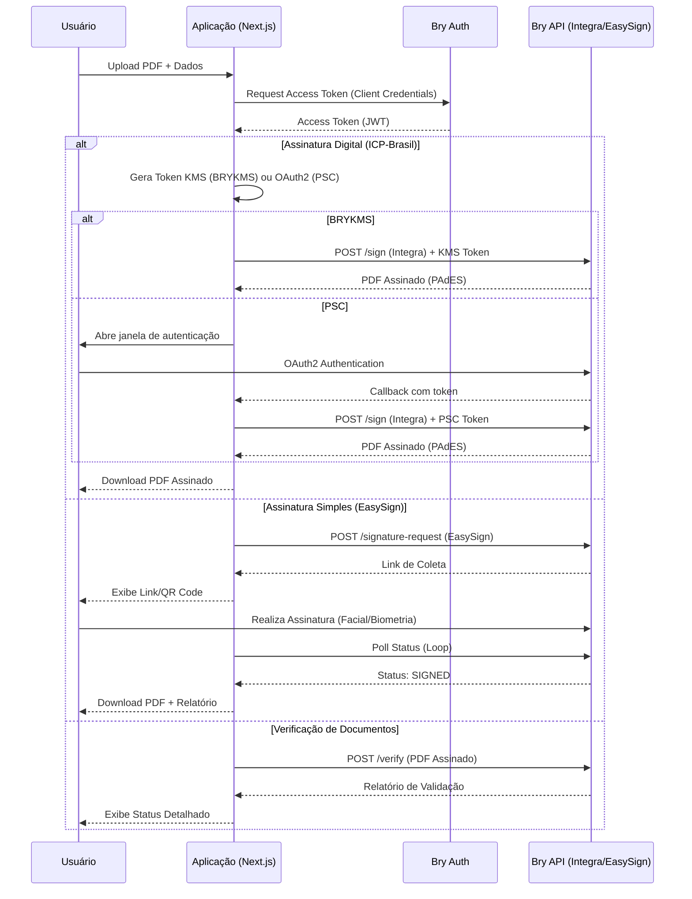

# BRY-SIGNER

Aplicação web para assinatura digital e eletrônica de documentos PDF integrando os serviços da Bry Tecnologia (Assinatura Simples e Digital ICP-Brasil).

## 🚀 Tecnologias


## ✨ Funcionalidades

O projeto suporta três fluxos distintos de assinatura via API da Bry Tecnologia:

### 1. Assinatura Digital (ICP-Brasil)
Focada em **validade jurídica máxima**. Utiliza certificados digitais em nuvem (Bry KMS / PSC).
- **Fluxo**: O backend utiliza credenciais KMS configuradas para assinar o PDF digitalmente.
- **Recursos**: Suporta carimbo do tempo, configuração visual da assinatura (imagem, texto, QR Code), validação de longo prazo (PAdES) e assinatura com imagem visual.
- **Endpoint**: Utiliza a API Integra (`/integra/v1`).
- **Métodos**: BRYKMS (ambiente de teste) e PSC (provedores externos como BirdID, SerproID).

### 2. Assinatura Simples (EasySign)
Focada em **praticidade e biometria**. Ideal para documentos que não exigem certificado ICP-Brasil, mas requerem validação de identidade (ex: reconhecimento facial).
- **Fluxo**: O usuário preenche dados (Nome, Email, CPF), faz upload do PDF e recebe um link para assinatura.
- **Validação**: Pode incluir biometria facial e geolocalização.
- **Endpoint**: Utiliza a API EasySign (`/fw/v1`).
- **Recursos**: Download do documento assinado e relatório de evidências.

### 3. Verificação de Documentos
Funcionalidade para **validar autenticidade** de documentos PDF assinados digitalmente.
- **Fluxo**: Upload do PDF assinado para verificação da validade das assinaturas.
- **Validação**: Verifica conformidade com Padrão ICP-Brasil (PAdES), integridade do documento e informações do signatário.
- **Endpoint**: Utiliza API de verificação da Bry.
- **Interface**: Página dedicada em `/verify` com relatório detalhado.

## ⚙️ Configuração

### Pré-requisitos
- Node.js 20+
- Credenciais de acesso à API da Bry (Client ID e Secret).
- (Opcional) Certificado Digital hospedado no Bry KMS.

### Instalação

```bash
# Instalar dependências
npm install

# Rodar em desenvolvimento
npm run dev
```

### Variáveis de Ambiente

Crie um arquivo `.env.local` na raiz do projeto com as seguintes variáveis:

| Variável | Descrição | Obrigatório |
| :--- | :--- | :---: |
| `BRY_CLIENT_ID` | Client ID fornecido pela Bry | Sim |
| `BRY_CLIENT_SECRET` | Client Secret fornecido pela Bry | Sim |
| `BRY_AUTH_URL` | URL de autenticação OAuth | Sim |
| `BRY_INTEGRA_URL` | URL base para Assinatura Digital (Integra) | Sim |
| `BRY_EASYSIGN_URL` | URL base para Assinatura Simples (EasySign) | Sim |
| `BRY_HUB_URL` | URL do Bry Hub | Sim |
| `NEXT_PUBLIC_APP_URL` | URL da aplicação (ex: http://localhost:3000) | Sim |
| `BRYKMS_UUID_CERT` | UUID do certificado no KMS (para assinatura digital) | Não* |
| `BRYKMS_USER` | Usuário do KMS | Não* |
| `BRYKMS_PIN` | PIN do usuário no KMS | Não* |

> *Obrigatório apenas para o fluxo de Assinatura Digital ICP-Brasil.

## 📡 Uso da API

### Assinatura Digital (Endpoint Interno)

**POST** `/api/bry/sign`

Assina um PDF utilizando um certificado em nuvem.

**Body (FormData):**
- `pdfBase64`: String Base64 do arquivo PDF.
- `fileName`: Nome do arquivo.
- `kmsToken`: Token de acesso ao KMS (obtido via `/api/bry/kms-token` ou gerado internamente).
- `kmsType`: Tipo do KMS (`BRYKMS` ou `PSC`).
- `useSignatureImage`: Booleano para incluir assinatura visual com QR Code (opcional).

**Exemplo de chamada:**

```typescript
const formData = new FormData();
formData.append('pdfBase64', 'JVBERi0xLjQK...');
formData.append('fileName', 'documento.pdf');
formData.append('kmsToken', 'eyJhbGciOiJIUz...');
formData.append('kmsType', 'BRYKMS');
formData.append('useSignatureImage', 'true');

const response = await fetch('/api/bry/sign', {
  method: 'POST',
  body: formData
});
```

### Geração de Token KMS

**POST** `/api/bry/kms-token`

Gera token de acesso para BRYKMS (ambiente de teste).

**Resposta:**
```json
{
  "token": "eyJhbGciOiJIUz...",
  "kmsType": "BRYKMS"
}
```

### Verificação de Documentos

**POST** `/api/bry/verify`

Verifica a validade de assinaturas digitais em PDF.

**Body (FormData):**
- `file`: Arquivo PDF assinado.

**Resposta:**
```json
{
  "status": "VALIDO",
  "icone": "✅",
  "resumo": "Documento autêntico e com validade jurídica.",
  "detalhes": {
    "medico": "Nome do Signatário",
    "cpf": "***.123.456-**",
    "emissor": "Soluti",
    "dataAssinatura": "2024-01-01T12:00:00Z",
    "integridade": "O documento não foi alterado."
  }
}
```

### Download de Documentos EasySign

**GET** `/api/bry/download`

Baixa documentos assinados ou relatórios de evidências do EasySign.

**Query Parameters:**
- `requestId`: ID da requisição de assinatura.
- `documentNonce`: Nonce do documento.
- `type`: Tipo de download (`signed` ou `report`).

### Status de Autenticação PSC

**GET** `/api/bry/status`

Verifica status de autenticação OAuth2 com PSC.

**Query Parameters:**
- `state`: Estado da sessão OAuth2.

### Callback OAuth2

**GET** `/api/bry/callback`

Endpoint de callback para autenticação OAuth2 com PSCs.

### Assinatura Simples (EasySign Action)

O fluxo é gerenciado via Server Actions em `src/actions/easySignActions.ts`.

```typescript
import { createSignatureRequest } from '@/actions/easySignActions';

const result = await createSignatureRequest(
  base64Pdf,
  'contrato.pdf',
  'João da Silva',
  'joao@email.com',
  '123.456.789-00', // CPF
  'CPF'
);

if (result.success) {
  console.log('Link para assinatura:', result.signatureLink);
}
```

## 🔄 Fluxo de Dados



## 🌐 Navegação e Páginas

### Página Principal (`/`)
- **Assinatura Digital**: Interface principal para assinatura com certificado ICP-Brasil.
- **Opções**: Escolha entre BRYKMS (teste) ou PSC (produção).
- **Recursos**: Upload de PDF, configuração de assinatura visual, QR Code para autenticação.

### Assinatura com Selfie (`/easysign`)
- **Assinatura Simples**: Interface dedicada para EasySign com captura facial.
- **Fluxo**: Formulário de dados → Captura facial via iframe → Download de documentos.
- **Recursos**: Suporte a CPF/CNPJ/RG/Passaporte, relatório de evidências.

### Verificação (`/verify`)
- **Validação**: Interface para verificar autenticidade de documentos assinados.
- **Recursos**: Upload de PDF, relatório detalhado da assinatura, informações do signatário.

## 📱 Interface do Usuário

### Componentes Principais
- **Signer.tsx**: Componente principal para assinatura digital ICP-Brasil.
- **EasySignPage.tsx**: Componente para assinatura simples com biometria.
- **VerifyPage.tsx**: Componente para verificação de documentos.

### Recursos de UI
- **Design Responsivo**: Interface adaptada para desktop e mobile.
- **Feedback Visual**: Indicadores de progresso, status e erros.
- **QR Codes**: Geração automática para links de autenticação.
- **Download Automático**: Inicia download dos documentos assinados.

## 🛠 Troubleshooting

### Erros Comuns

1.  **Erro `401 Unauthorized` na API da Bry**
    *   **Causa**: `BRY_CLIENT_ID` ou `BRY_CLIENT_SECRET` inválidos, ou token expirado.
    *   **Solução**: Verifique as credenciais no `.env` e se o serviço de autenticação está acessível.

2.  **Certificado não encontrado (`BRYKMS`)**
    *   **Causa**: O `BRYKMS_UUID_CERT` não corresponde a um certificado válido para o usuário `BRYKMS_USER`.
    *   **Solução**: Liste os certificados disponíveis para o usuário no painel da Bry ou via API para obter o UUID correto.

3.  **Erro na Assinatura Simples (EasySign)**
    *   **Causa**: CPF inválido ou formato incorreto.
    *   **Solução**: O sistema remove caracteres não numéricos automaticamente, mas certifique-se de enviar um CPF válido com 11 dígitos.

4.  **CORS ou Erro de Rede**
    *   **Causa**: Chamadas diretas do frontend para a API da Bry podem ser bloqueadas.
    *   **Solução**: Utilize sempre as API Routes (`/api/bry/*`) ou Server Actions como proxy para comunicação com a Bry.

5.  **Timeout na Autenticação PSC**
    *   **Causa**: Janela de autenticação não fechada ou polling interrompido.
    *   **Solução**: Verifique se a janela popup foi aberta e se o callback está sendo processado corretamente.

6.  **Erro na Verificação de Documentos**
    *   **Causa**: PDF não assinado ou assinatura corrompida.
    *   **Solução**: Verifique se o documento possui assinaturas digitais válidas antes de enviar para verificação.

## 📝 Diretrizes de Desenvolvimento

-   **Clean Code**: Mantenha a separação entre *Actions* (Lógica de Servidor), *Services* (Comunicação com API Externa) e *Components* (UI).
-   **Logs**: Utilize `console.info` para fluxo normal e `console.error` para exceções, facilitando o debug no servidor.
-   **Tipagem**: Mantenha as interfaces TypeScript atualizadas em `src/services/bryClient.ts` conforme a documentação da Bry evolui.
-   **Segurança**: Armazene tokens e credenciais de forma segura utilizando os serviços de storage implementados.
-   **Performance**: Implemente polling eficiente para status de assinaturas e utilize cache quando apropriado.

## 🏗️ Estrutura do Projeto

```
src/
├── actions/              # Server Actions (lógica de negócio)
│   ├── bryActions.ts     # Ações para assinatura digital
│   └── easySignActions.ts # Ações para assinatura simples
├── app/                  # Páginas e API Routes
│   ├── api/
│   │   └── bry/         # Endpoints da API Bry
│   │       ├── callback/    # OAuth2 callback
│   │       ├── download/    # Download EasySign
│   │       ├── kms-token/   # Token BRYKMS
│   │       ├── sign/        # Assinatura digital
│   │       ├── status/      # Status OAuth2
│   │       └── verify/      # Verificação
│   ├── easysign/         # Página EasySign
│   ├── verify/           # Página de verificação
│   ├── layout.tsx        # Layout principal
│   └── page.tsx          # Página principal
├── components/           # Componentes React
│   ├── Signer.tsx        # Componente principal
│   └── EasySignPage.tsx  # Componente EasySign
└── services/             # Serviços de integração
    ├── bryAuthService.ts # Autenticação Bry
    ├── bryClient.ts      # Cliente Bry API
    ├── bryEasySignService.ts # Serviço EasySign
    ├── secureStorage.ts  # Armazenamento seguro
    └── signPdfService.ts # Serviço de assinatura
```

## 📦 Dependências Adicionais

- **jimp**: Processamento de imagens para assinatura visual.
- **qrcode.react**: Geração de QR Codes para links de autenticação.
